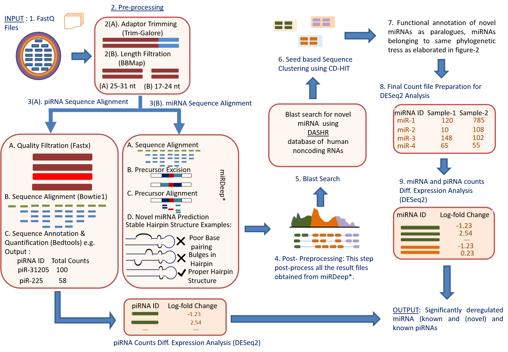
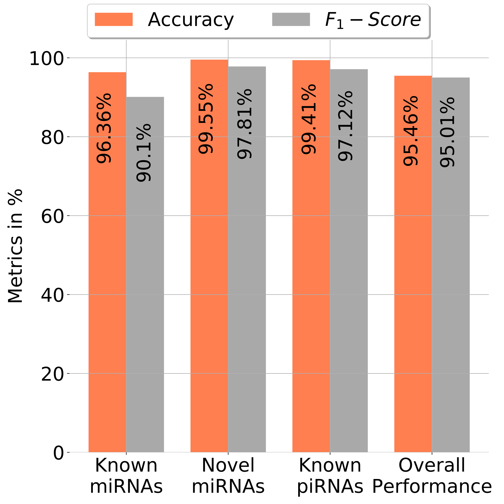
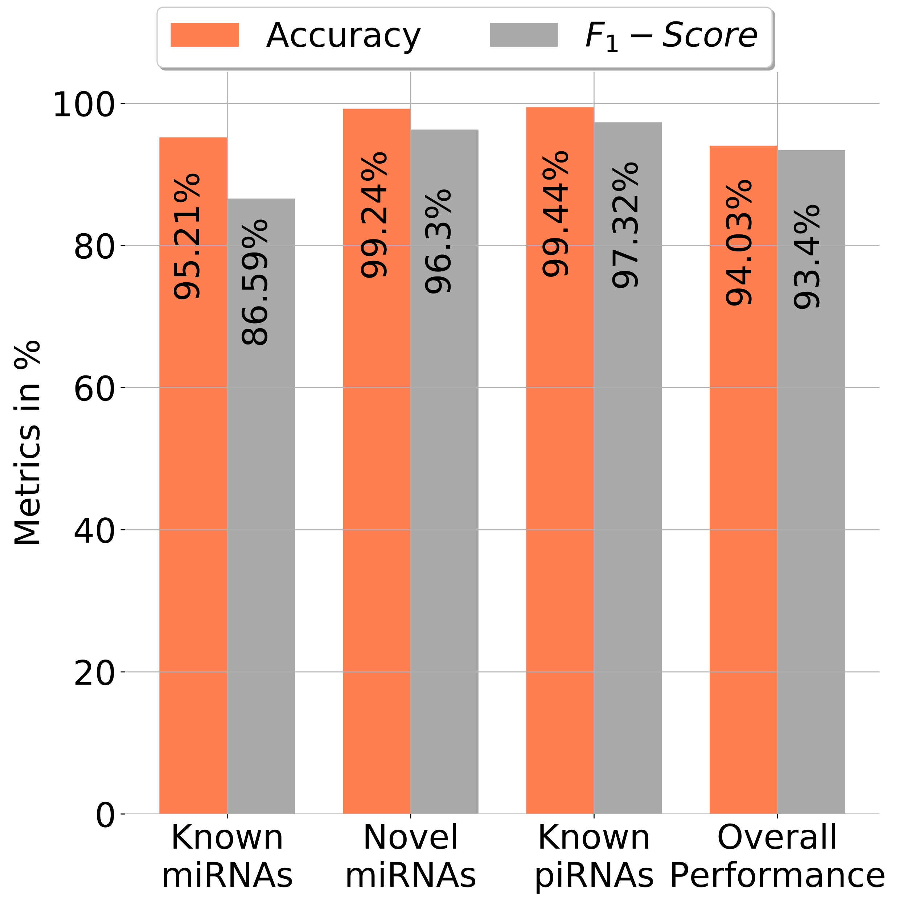
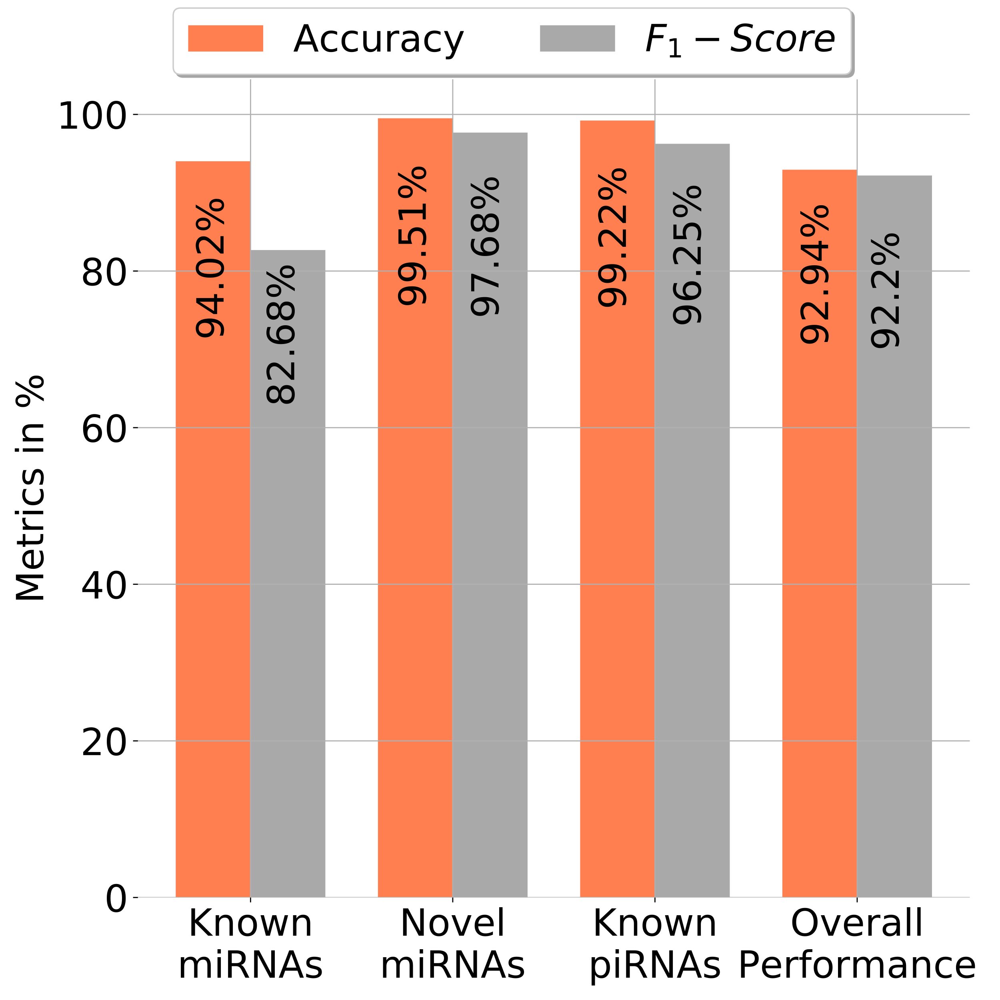

# miRPipe: Open source RNA-Seq bioinformatics analysis docker for identification of miRNAs and piRNAs



Figure-1: In the pipeline flowchart, there are 9 steps. In synthetic data experiments, the last step (step-9: differential expression analysis) is not included. However in the CLL data experiments, we have included the last step where both treated and untreated samples are available.

## Introduction

miRPipe is the integrated, user-friendly jupyter notebook based RNA-Seq bioinformatics analysis docker. The aim of this docker is to help researchers perform miRNA identification and piRNA identification independently and with much ease.

## Project Structure
```
|----- Demo_data
           |----- exp1_50K
                     |----- synthetic_data_50K.fastq.gz
                     |----- mirna2.csv
                     |----- novel_mirna2.csv
                     |----- pirna2.csv
                     |----- multi_class_c_matrix.csv
                     |----- multi_classc_matrix_performance.csv
           |----- exp2_0.1M
                     |----- synthetic_data_0.1M.fastq.gz
                     |----- mirna2.csv
                     |----- novel_mirna2.csv
                     |----- pirna2.csv
                     |----- multi_class_c_matrix.csv
                     |----- multi_classc_matrix_performance.csv
           |----- exp3_1M
                     |----- synthetic_data_1M.fastq.gz
                     |----- mirna2.csv
                     |----- novel_mirna2.csv
                     |----- pirna2.csv
                     |----- multi_class_c_matrix.csv
                     |----- multi_classc_matrix_performance.csv
           |----- Sample_list.csv
|----- CLL_results
          |----- miRNA_significantly_DE_mir.csv
          |----- miRNA_DEmir_Res.tsv
          |----- miRNA_DEmir_Counts.tsv
          |----- mir_reannotation.csv
          |----- counts_final_1.csv
          |----- piRNA_raw_counts.csv
          |----- piRNA_significantly_DE_mir.csv
          |----- miRNA_DEmir_Counts_1.csv
          |----- counts_final_novel_mir_new_names.csv
|----- LICENSE
|----- refs
         |----- pirnadb
                   |----- pirnadb.hg19.gff3.gz
                   |----- pirnadb.hg38.gff3.gz     
|----- scripts
         |----- adaptor_trimming.sh
         |----- fastq_split.sh
         |----- FastQC.R
         |----- install_packages.R
         |----- mirdeep_star.sh
         |----- norm_diff_exp.R
         |----- piRNA_pipeline.sh
|----- Dockerfile
|----- geckodriver
|----- geckodriver.log
|----- get-pip.py
|----- miRPipe_Flowchart.png
|-----|----- miRPipe_synthetic.ipynb (for synthetic data experiments)*
      |----- miRPipe_pipeline.ipynb (complete pipeline)
|----- notebook.sh
|----- README.md
|----- requirements.txt

*: This notebook will be used only for synthetic data experiments.
```

## Running the RNA-SEQ Pipeline

We have created a Docker image packaging all the dependencies (command line tools, R and Python packages) for the pipeline, which are publically available. To run the Docker image on your local machine, you need to pull the docker image.

It's very important to check the system requirements before installing the docker image.

### System Requirements

Presently, this pipeline is tested only for the Linux OS.
##### LINUX Operating System:

System Requirements:

• 64bit, 8.00 GB RAM

• OS version used for this pipeline: Ubuntu 18.04.

### Prerequisites

Things that needs to be install before running miRPipe.

a) docker
```
sudo apt-get update
sudo apt-get install docker-ce
```

### Build Docker
After installing the docker, docker build is required to get the docker running.

To build, run the follwing command

```

docker pull docker.io/vivekruhela/mirpipe

```

```diff
- For reviewers
```
The following login credentials and command can be used to pull the private docker image. This docker image will converted into public repository after successfully tested by reviewers.

```diff
+ User ID: mirpipedockertest
+ Password : iiitdelhi123

Commands:
1. If you are already logged into your docker accout then logout with the help of following account:

docker logout

2. First you need to login to docker hub using above credentials with the help of following command.

docker login -u mirpipedockertest

3. After successful login. you can pull the miRPipe docker image using following command:

docker pull docker.io/vivekruhela/mirpipe
```

# Execution of docker

To run the docker with administration rights, run the following command at terminal.

```
docker run -p 8880:8888 -e 'PASSWORD=password' -e 'USE_HTTP=1' -v /host_path_to_data/:/miRPipe/data docker.io/vivekruhela/mirpipe

```

Explanation of execution step-

`sudo docker run` - Runs the docker with administrative rights.

`-p 8880:8888` - Defines the port of the server and the port at which the docker will run.

`-e 'PASSWORD=password'` - Defines the password as "password", it can be changed as required by the user.

`-e 'USE_HTTP=1'` - To run in HTTP, we use USE_HTTP environment variable. Setting it to a non-zero value enables HTTP.

`-v  /host/path/to/data:/miRPipe/data` - Mount the host folder which contains raw fastq sequence file to data folder of miRPipe docker

```diff
+ Example:

docker run -p 8880:8888 -e 'PASSWORD=password' -e 'USE_HTTP=1' -v /home/vivek/Small_fastq:/miRPipe/data vivekruhela/mirpipe
```
After successfully running the docker execution command, open firefox browser, and type the follwing in the URL:

```
localhost:8880/mirpipe
```
Jupyter Notebook environment will be opened in Firefox browser.
Enter the PASSWORD mentioned in above command, by default it is set to- password


## (A) Synthetic Data Experiments

For demonstration purpose, we are running these experiments only one time for each read depth category while in the figure-5 of the manuscript, we have shown the avaerge performance of mirPipe for 10 runs.
The accuracy and F1-score of 1 run is close to the average accuracy and F1-score shown in the table-4 of the main manuscript.

### Data Generation for Synthetic Data Experiments
We have used [miRSim](https://github.com/vivekruhela/miRSim)[1] tool to generate the synthetic data. The sample data files generated for demo are available in `Demo_data` directory. 

For the sake of completion, we have also provided the commands below for synthetic data generation using miRSim tool in case any user would like to generate synthatic data on their own.

```diff
- Data generation for 50K Read Depth Synthetic Data Experiments

+ Known miRNA synthetic data generation:

python miRSim.py -i refs/mature_high_conf_hsa.fa -n mirna2.fastq.gz -g mirna2.csv -gff refs/hsa_high_conf.gff3 -t 50000 -st 20 -s 10 -x 10 -b 5 -se 1008 -th 12 -dist uniform -d 20 -rna miRNA

+ Novel miRNA synthetic data generation:

python miRSim.py -i refs/final_novel_seq_filtered.fa -n novel_mirna2.fastq.gz -g novel_mirna2.csv -gff refs/novel_gff.gff3 -t 50000 -st 10 -s 7 -x 7 -b 3.5 -se 1008 -th 12 -rna novel_mirna -dist uniform -d 20

+ Known piRNA synthetic data generation:

python miRSim.py -i refs/piRNAdb.hsa.v1_7_5.fa -n pirna2.fastq.gz -g pirna2.csv -gff refs/pirnadb.hg38.gff3 -t 50000 -st 10 -s 7 -x 7 -b 3.5 -se 1008 -th 12 -rna piRNA -dist uniform -d 20

zcat mirna2.fastq.gz novel_mirna2.fastq.gz pirna2.fastq.gz | gzip > synthetic_data.fastq.gz
```

```diff
- Data generation for 0.1M Read Depth Synthetic Data Experiments

+ Known miRNA synthetic data generation:

python miRSim.py -i refs/mature_high_conf_hsa.fa -n mirna2.fastq.gz -g mirna2.csv -gff refs/hsa_high_conf.gff3 -t 100000 -st 20 -s 10 -x 10 -b 5 -se 108 -th 12 -dist uniform -d 20 -rna miRNA

+ Novel miRNA synthetic data generation:

python miRSim.py -i refs/final_novel_seq_filtered.fa -n novel_mirna2.fastq.gz -g novel_mirna2.csv -gff refs/novel_gff.gff3 -t 100000 -st 10 -s 7 -x 7 -b 3.5 -se 108 -th 12 -rna novel_mirna -dist uniform -d 20

+ Known piRNA synthetic data generation:

python miRSim.py -i refs/piRNAdb.hsa.v1_7_5.fa -n pirna2.fastq.gz -g pirna2.csv -gff refs/pirnadb.hg38.gff3 -t 100000 -st 10 -s 7 -x 7 -b 3.5 -se 108 -th 12 -rna piRNA -dist uniform -d 20


zcat mirna2.fastq.gz novel_mirna2.fastq.gz pirna2.fastq.gz | gzip > synthetic_data.fastq.gz
```

```diff
- Data generation for 1M Read Depth Synthetic Data Experiments

+ Known miRNA synthetic data generation:

python miRSim.py -i refs/mature_high_conf_hsa.fa -n mirna2.fastq.gz -g mirna2.csv -gff refs/hsa_high_conf.gff3 -t 1000000 -st 20 -s 10 -x 10 -b 5 -se 999 -th 12 -dist uniform -d 50 -rna miRNA

+ Novel miRNA synthetic data generation:

python miRSim.py -i refs/final_novel_seq_filtered.fa -n novel_mirna2.fastq.gz -g novel_mirna2.csv -gff refs/novel_gff.gff3 -t 1000000 -st 10 -s 7 -x 7 -b 3.5 -se 999 -th 12 -rna novel_mirna -dist uniform -d 50

+ Known piRNA synthetic data generation:

python miRSim.py -i refs/piRNAdb.hsa.v1_7_5.fa -n pirna2.fastq.gz -g pirna2.csv -gff refs/pirnadb.hg38.gff3 -t 1000000 -st 10 -s 7 -x 7 -b 3.5 -se 999 -th 12 -rna piRNA -dist uniform -d 50


zcat mirna2.fastq.gz novel_mirna2.fastq.gz pirna2.fastq.gz | gzip > synthetic_data.fastq.gz
```


The miRPipe pipeline performance for 1 run of synthetic data experiments are as follows:

| (A) 50K Read Depth | (B) 0.1M Read Depth | (C) 1M Read Depth |
| :------------- | :------------- |:------------- |
|  |  | |

[//]: <> (#### For 50K Read Depth Synthetic Data Experiments)
[//]: <> ( )

### Output Files
For each run of `miRPipe_synthetic.ipynb`, two output files will be generated:
1. `multi_class_c_matrix.csv`: This files contains sequence counts for each category of RNAs.
2. `multi_classc_matrix_performance.csv`: This file contains all the performance matrics for miRPipe pipeline.

## (B) CLL Data Experiments

All the results shown in table-5 and table-6  are generated using miRPipe for the datasets taken from GEO repository [GSE123436](https://www.ncbi.nlm.nih.gov/geo/query/acc.cgi?acc=GSE123436) [[2](https://www.nature.com/articles/s41408-019-0272-y)].

Since the dataset is very huge, to demonstrate the working of miRPipe we have prepared a small subset of treated and untreated samples from the GSE123436 CLL datasets (snapshot shown below). The prepared file `sample_list.csv` in the data directory in the following format:
```
sample           file          condition
Sample_A   Sample_A.fastq.gz    treated
Sample_B   Sample_B.fastq.gz    treated
Sample_C   Sample_C.fastq.gz    treated
   .              .                .
   .              .                .
   .              .                .
```
Please note that, in `sample_list.csv`, it is absolutely a must to sort all the sample name alphanumerically. This is necessary because the final count file generated at the end of pipeline (and before differential expression analysis) have all the columns sorted in alpha-numerically ascending order. The order of columns in final count matrix generated in the end of pipeline and order in samples in `sample_list.csv` must be same in order to conduct correct differential expression analysis. The example screenshot `sample_list.csv` file (located in Demo_data) for CLL data is shown below:


### Output Files

The miRPipe pipeline generates total 9 output files:

1. `miRNA_significantly_DE_mir.csv` : This file contains the list of significantly differentially expressed miRNAs (Location: In the same directory where all fastq files are stored).

2. `miRNA_DEmir_Res.tsv`  : This file contains significantly differentially expressed miRNA along with p_adj values (Location: In the same directory where all fastq files are stored).

3. `miRNA_DEmir_Counts.tsv` : This file contains counts of significantly differentially expressed miRNAs in all samples (Location: In the same directory where all fastq files are stored).

4. `mir_reannotation.csv` : This file contains results from functional annotation modules (Location: In the same directory where all fastq files are stored).

5. `counts_final_1.csv` : This file contains all miRNAs raw counts obtained form all samples before differential expression analysis (Location: In the same directory where all fastq files are stored).

6. `piRNA_raw_counts.csv` :  This file contains raw counts of all piRNAs ontained from all samples before differential expression analysis (Location: `piRNA/piRNA_raw_counts.csv`).

7. `piRNA_significantly_DE_mir.csv` : This file contains the list  of all significantly differentially expressed piRNAs (Location: `piRNA/piRNA_significantly_DE_mir.csv`).

8. `counts_final_novel_mir_new_names.csv` : This file consists the new putative names of identified novel miRNAs according to miRBase nomenclature system.

9. `miRNA_DEmir_Counts_1.csv` : This file contains the counts of novel miRNAs only with new putative names.

## References

1. miRSim: Seed-based RNA-Seq Synthetic Sequence Simulator
2. Kaur, Gurvinder, et al. "RNA-Seq profiling of deregulated miRs in CLL and their impact on clinical outcome." Blood cancer journal 10.1 (2020): 1-9.

## 7. Authors

* **Vivek Ruhela** - *Initial work* - [github](https://github.com/vivekruhela)


## 8. License

See the [LICENSE](LICENSE) file for license rights and limitations (Apache2.0).

## 9. Acknowledgements

1. Authors would like to gratefully acknowledge the grant from Department of Biotechnology, Govt. of India [Grant: BT/MED/30/SP11006/2015] and Department of Science and Technology, Govt. of India [Grant: DST/ICPS/CPS-Individual/2018/279(G)].

2. Authors would like to gratefully acknowledge the support of SBILab, Deptt. of ECE & Centre of Excellence in Healthcare, Indraprastha Institute of Information Technology-Delhi (IIIT-D), India for providing guidance in tool methology and development.

3. Authors would like to gratefully acknowledge the support of Computational Biology Dept., Indraprastha Institute of Information Technology-Delhi (IIIT-D), India for providing resources for tool development.
