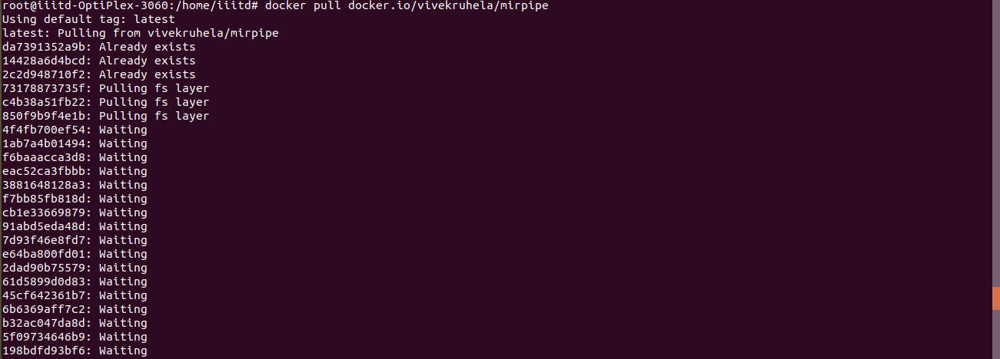
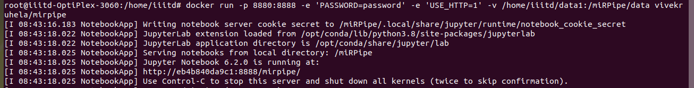
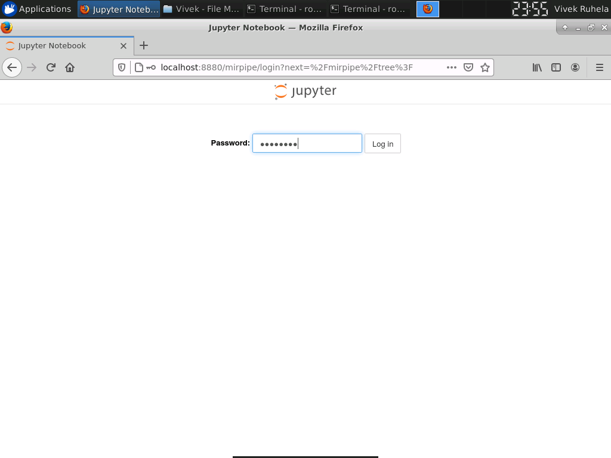
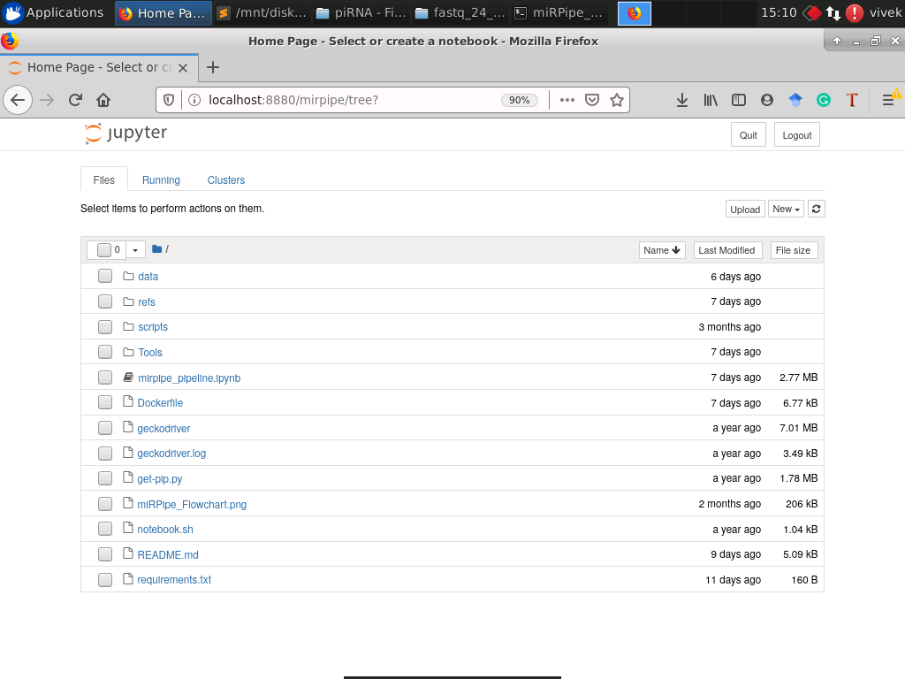

# Tutorial

## Downloading the docker image

You can download the docker image using the follwing command:

```
docker pull docker.io/vivekruhela/mirpipe
```

You should see the following response from the command:



After successfully pulling the docker image, you need to create a directory to allocate all `fastq.gz` files and `sample_list.csv` file. After that, you can use the following command to execute the docker and mount the data directory to docker data directory:

```
docker run -p 8880:8888 -e 'PASSWORD=password' -e 'USE_HTTP=1' -v /host_path_to_data/:/miRPipe/data docker.io/vivekruhela/mirpipe
```

Simpley change the `/host_path_to_data/` to your data directory path that contains all the `fastq.gz` files and `sample_list.csv` file. You should see the following response after using the above command:



Once the docker image is executed, you should open the internet browser and type the following address:

```
localhost:8880/mirpipe
```

The above address will prompt to the password page (as shown below):



You need to enter the password that you have mentioned in the `docker run` command with argument `Password`. In the above command, we have used `PASSWORD=password`. So enter the word `password` to log in into the jupyter notebook of the docker. Once you have given the correct password, this'll open the jupyter notebook with all the data and installed tools and libraries (as shown below).


