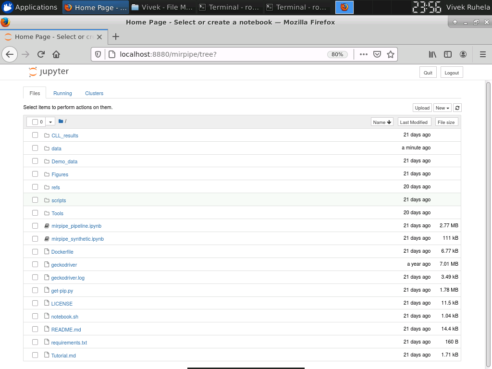

# Tutorial

## Downloading the docker image

You can download the docker image using the follwing command:

```
docker pull docker.io/vivekruhela/mirpipe
```

You should see the following response from the command:


## Running miRPipe docker

After successfully pulling the docker image, you need to create a directory to allocate all `fastq.gz` files and `sample_list.csv` file. After that, you can use the following command to execute the docker and mount the data directory to docker data directory:

```
docker run -p 8880:8888 -e 'PASSWORD=password' -e 'USE_HTTP=1' -v /host_path_to_data/:/miRPipe/data docker.io/vivekruhela/mirpipe
```

Simply change the `/host_path_to_data/` to your data directory path that contains all the `fastq.gz` files and `sample_list.csv` file. You should see the following response after using the above command:


Once the docker image is executed, you should open the internet browser and type the following address:

```
localhost:8880/mirpipe
```

The above address will prompt to the password page (as shown below):


You need to enter the password that you have mentioned in the `docker run` command with argument `Password`. In the above command, we have used the default password `PASSWORD=password`. So enter the word `password` to log in into the jupyter notebook of the docker. Once you have given the correct password, this'll open the jupyter notebook with all the data and installed tools and libraries (as shown below).



## Steps to reproduce synthetic data experiments results
1. Pull the miRPipe docker image using the steps shown above.
2. Download the [miRSim](https://github.com/vivekruhela/miRSim) tool for synthetic data generation.
3. Generate the synthetic data using the miRSim commands shown in README file.
4. Run the miRPipe docker by mounting the synthetic data directory and open `mirpipe_synthetic.ipynb` notebook.
4. Choose default adaptor (option-1) when notebook asks for providing adaptor sequence.
5. Choose the default option for sequence alignment (option-4) (i.e. human genome hg38 and miRBase version 22).
6. You should see the final output files i.e. `multi_class_c_matrix.csv` and `multi_classc_matrix_performance.csv` in the same data directory after successful running of miRPipe pipeline and pipeline evaluation module.

## Steps to reproduce CLL data results
1. Pull the miRPipe docker image using the steps shown above.
2. Download the CLL data from GEO repository [GSE123436](https://www.ncbi.nlm.nih.gov/geo/query/acc.cgi?acc=GSE123436).
3. Copy the `sample_list.csv` file for CLL data from `Demo_data` directory in miRPipe github repository.
4. Run the miRPipe docker by mounting the CLL data directory and open `mirpipe_pipeline.ipynb` notebook. If path is correct, you should see all your data files in data directory of miRPipe docker (as shown below)


4. Use the sequence `TGGAATTCTCGGGTGCCAAGG` as adaptor when notebook asks for providing the adaptor sequence.
5. Choose the option-1 for sequence alignment (i.e. human genome hg37 and miRBase version 19).
6. You should see the all 9 output files in the same data directory after successful running of miRPipe pipeline.