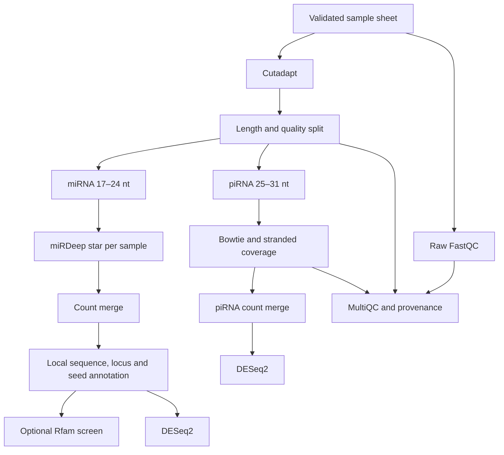

# miRPipe-HPC

`miRPipe-HPC` is a non-interactive, resumable Nextflow DSL2 implementation of the original `mirpipe_pipeline.ipynb`. It is designed for single-end small-RNA sequencing on SLURM clusters while retaining local Docker and Apptainer execution profiles.

The notebook remains unchanged. This directory is an independently runnable workflow so existing miRPipe users can compare results before adopting it.

## What this implementation fixes

| Legacy behavior | HPC behavior |
|---|---|
| Interactive notebook prompts | Version-controlled YAML parameters |
| Python threads on one machine | One scheduler task per sample and stage |
| Re-downloads and mutable web scraping | Reusable container/reference paths and local annotation |
| Manual sample/column sorting | Validated IDs and name-based count/metadata matching |
| Temporary files deleted during the run | Immutable task work directories and explicit published results |
| Rerun from the beginning after failure | Nextflow cache with `-resume` |
| Hard-coded two-group DESeq2 model | User-defined design formula and contrast |
| No complete provenance | Versions, checksums, trace, report, timeline, DAG, and MultiQC |
| Length 24 implicitly consumed before the piRNA branch | Explicit, non-overlapping defaults: miRNA 17–24 nt; piRNA 25–31 nt |
| DASHR queried using Selenium | Local exact/reverse-complement/coordinate matching against versioned FASTA/GFF |
| Novel names assigned as if official | Stable locus/sequence IDs and evidence tiers; no unofficial miRBase names |

## Workflow



## Requirements

- Nextflow `>=24.04.0`
- Java 11 or newer for Nextflow
- SLURM plus Apptainer/Singularity for the `slurm` profile
- A single-end FASTQ or FASTQ.GZ per biological sample
- miRDeep\*, Bowtie index, miRNA reference FASTA/GFF, and piRNA GFF compatible with the selected genome build

The default tool paths match `docker.io/vivekruhela/mirpipe:latest`. For a publication run, create a local SIF from a fixed image digest, record its SHA-256, and set `container` to that immutable file. `latest` is provided only for backward compatibility and is not a sufficient archival pin.

## 1. Prepare the sample sheet

Copy `assets/samplesheet.example.csv`. Required columns are:

| Column | Meaning |
|---|---|
| `sample` | Unique ID containing letters, numbers, `.`, `_`, or `-` |
| `fastq` | Absolute path, or a path relative to the sample sheet |
| `condition` | Biological group used in the default DE model |

Additional columns such as `batch`, `sex`, `age`, `pair`, or `RIN` are retained and may be used in `design`.

```csv
sample,fastq,condition,batch
CLL_U01,/data/CLL_U01.fastq.gz,untreated,batch1
CLL_U02,/data/CLL_U02.fastq.gz,untreated,batch1
CLL_T01,/data/CLL_T01.fastq.gz,treated,batch1
CLL_T02,/data/CLL_T02.fastq.gz,treated,batch1
```

Technical lanes must be merged before this alpha release. Paired-end input is intentionally rejected because standard small-RNA libraries are single-end.

## 2. Configure the run

```bash
cd hpc_workflow
cp assets/params.example.yml params.yml
cp assets/samplesheet.example.csv samplesheet.csv
```

Edit `params.yml`. The most important parameters are:

| Parameter | Default | Purpose |
|---|---:|---|
| `adapter` | `TCGTATGCCGTCTTCTGCTTG` | 3′ library adapter |
| `genome` | `hg38` | Must match every supplied reference |
| `run_mirna`, `run_pirna` | `true` | Enable either analysis branch |
| `run_rfam` | `false` | Screen novel precursors with a local, indexed Rfam CM |
| `design` | `~ condition` | Valid R design formula using sample-sheet columns |
| `contrast` | `condition,treated,untreated` | Variable, numerator, denominator |
| `min_count`, `min_samples` | `10`, `2` | Independent pre-DE count filter |
| `mirdeep_jar` | container path | miRDeep\* `MD.jar` |
| `mirdeep_genome_dir` | container path | Directory containing miRDeep\* genome folders |
| `known_mature_fasta`, `known_mirna_gff` | container paths | Version-matched local miRNA catalogue |
| `bowtie_index`, `pirna_gff` | container/repository paths | Same-build piRNA alignment references |

For the CLL experiment, use the paper's adapter `TGGAATTCTCGGGTGCCAAGG` and verify the historical genome/miRBase combination before comparing with published tables.

## 3. Run locally

```bash
nextflow run main.nf \
  -profile docker \
  -params-file params.yml \
  -resume
```

Use `-profile apptainer` for a local Apptainer installation. The `standard` profile assumes every executable is already on `PATH` and the configured miRDeep/reference paths are visible.

## 4. Run on SLURM

The login/driver job is lightweight; compute-heavy processes are submitted as child jobs.

```bash
sbatch submit_mirpipe.slurm
```

If your cluster requires an account, queue, or constraint:

```bash
cp conf/columbia.example.config /path/to/columbia.config
nextflow run main.nf \
  -profile slurm \
  -c /path/to/columbia.config \
  -params-file params.yml \
  -work-dir /path/to/persistent/work \
  -resume
```

Keep both the Nextflow `.nextflow` cache and the work directory until the analysis is finalized; both are needed for a true resumed run.

## Outputs

```text
results/
├── preprocessing/
│   ├── trimmed/
│   └── length_split/
├── qc/
│   ├── fastqc/
│   └── multiqc/multiqc_report.html
├── mirna/
│   ├── mirdeep_star/
│   ├── counts/
│   ├── annotation/
│   └── differential_expression/
├── pirna/
│   ├── alignment/
│   ├── counts/
│   └── differential_expression/
└── pipeline_info/
    ├── software_versions.txt
    ├── execution_trace.tsv
    ├── execution_report.html
    ├── execution_timeline.html
    └── workflow_dag.html
```

The annotation table distinguishes exact known matches, reverse-complement matches, sequence matches at discordant loci, external-database matches, and genuinely unresolved candidates. Novel candidates receive transparent evidence scores based on caller score, star reads, recurrence, and abundance. These tiers are prioritization aids, not proof of a new miRNA.

## Accuracy and interpretation notes

1. All genome-dependent files must use the same assembly and chromosome naming convention. Mixing hg19 and hg38 is a hard scientific error even when commands finish.
2. The default piRNA mapper reports one best alignment. This preserves integer counts for DESeq2 but does not solve repeat-derived multi-mapping. miRPipe2 should add a validated probabilistic or locus-aware model.
3. A read overlapping a piRNAdb feature is *piRNA-annotated*, not automatically evidence of active piRNA biogenesis. Ping-pong, nucleotide-bias, cluster, transposon, and PIWI-expression evidence belongs in miRPipe2.
4. Stable `novel:<locus>:<sequence-hash>` IDs deliberately replace sequential unofficial miRNA names.
5. Do not enable overlapping miRNA/piRNA length intervals unless duplicated classification is intentional.

## Validation

Helper scripts use only the Python standard library and have unit tests:

```bash
bash tests/run_tests.sh
python3 -m compileall -q bin tests
bash -n submit_mirpipe.slurm
```

A full end-to-end test additionally requires Nextflow, the analysis container, indexes, and a small-RNA FASTQ fixture. Before publication, add a truth-set integration test and pin its expected checksums.

## miRPipe2

The proposed biological evidence model, feature matrix, benchmarking design, and phased implementation plan are in [`docs/MIRPIPE2_ROADMAP.md`](docs/MIRPIPE2_ROADMAP.md).
